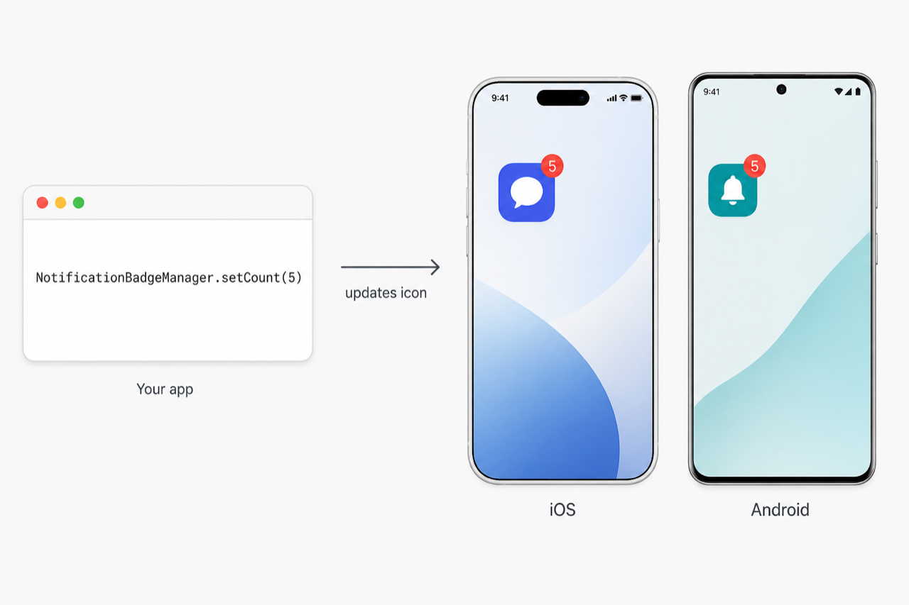

# react-native-notification-badge-manager

[English](README.md) | [Türkçe](README.tr.md)

Set, read, and clear the **app icon notification badge** on iOS and Android from React Native.

Requires **React Native 0.73 or later**. Works with autolinking, TypeScript, Expo development builds, and both the old and new React Native architectures (legacy native module + New Architecture interop).

[](https://www.npmjs.com/package/react-native-notification-badge-manager)



`NotificationBadgeManager.setCount(5)` → red badge **5** on the iOS and Android home screen icons.

## Features

- `setCount` / `getCount` / `clear`
- `increment` / `decrement` (never below `0`)
- iOS badge permission request (`UserNotifications`)
- Android 13+ `POST_NOTIFICATIONS` request
- `useNotificationBadge()` React hook
- Stock Android badges via a silent notification
- OEM launcher badges: Samsung, Huawei, Honor, Xiaomi, OPPO, vivo, Sony, HTC, Asus, Nova, Apex, ZTE
- Configurable Android notification channel title/body
- Apple privacy manifest included

## Installation

```bash
npm install react-native-notification-badge-manager
```

or

```bash
yarn add react-native-notification-badge-manager
```

### iOS

```bash
cd ios && pod install && cd ..
```

Rebuild the native app after installing.

### Android

Permissions are merged from the library manifest. On Android 13+ (API 33) you still need to request `POST_NOTIFICATIONS` at runtime — use `requestPermission()`.

### Expo

Expo Go is **not** supported. Requires Expo SDK **50** or later (React Native 0.73+). Use a [development build](https://docs.expo.dev/develop/development-builds/introduction/) or prebuild:

```json
{
  "expo": {
    "plugins": ["react-native-notification-badge-manager"]
  }
}
```

```bash
npx expo prebuild
npx expo run:ios
# or
npx expo run:android
```

## Usage

```ts
import NotificationBadgeManager from 'react-native-notification-badge-manager';

await NotificationBadgeManager.requestPermission();
await NotificationBadgeManager.setCount(5);

const count = await NotificationBadgeManager.getCount();

await NotificationBadgeManager.increment();
await NotificationBadgeManager.decrement(2);
await NotificationBadgeManager.clear();
```

### React hook

```tsx
import { useNotificationBadge } from 'react-native-notification-badge-manager';

function UnreadBadgeButton() {
  const { count, increment, clear } = useNotificationBadge();

  return (
    <>
      <Button title={`Unread: ${count}`} onPress={() => increment()} />
      <Button title="Clear" onPress={() => clear()} />
    </>
  );
}
```

### Android options

Stock Android (Pixel / AOSP) shows launcher badges from notifications. The library posts a silent, low-importance notification for that. OEM launchers (Samsung, Xiaomi, …) also receive their own badge APIs.

```ts
await NotificationBadgeManager.configure({
  android: {
    useNotification: true,
    channelName: 'App icon badge',
    contentTitle: 'Unread',
    contentText: 'You have %count% unread items',
  },
});
```

Set `useNotification: false` if you only want OEM launcher broadcasts and do not want a silent notification.

### With push notifications

Call this library when your app learns the unread count — for example after a FCM/APNs message or when the inbox is opened:

```ts
messaging().onMessage(async (message) => {
  const unread = Number(message.data?.unreadCount ?? 0);
  await NotificationBadgeManager.setCount(unread);
});
```

On iOS, the APNs payload can also set the badge with `"badge": 3`. This package is for **in-app control** of the same icon badge.

## API

| Method | Returns | Description |
| --- | --- | --- |
| `setCount(count)` | `Promise<number>` | Set the badge. Negative / non-finite values become `0`. |
| `getCount()` | `Promise<number>` | Read the current badge. |
| `clear()` | `Promise<void>` | Set the badge to `0`. |
| `increment(by?)` | `Promise<number>` | Add `by` (default `1`). |
| `decrement(by?)` | `Promise<number>` | Subtract `by` (default `1`), minimum `0`. |
| `requestPermission()` | `Promise<boolean>` | iOS badge auth / Android 13+ notifications. |
| `checkPermission()` | `Promise<'granted' \| 'denied' \| 'undetermined'>` | Current permission, no prompt. |
| `configure(options)` | `Promise<void>` | Android notification / channel options. |
| `isSupported()` | `boolean` | `true` on iOS and Android. |
| `setBadgeCount(count)` | `Promise<number>` | Deprecated alias of `setCount`. |
| `clearBadge()` | `Promise<void>` | Deprecated alias of `clear`. |

Named export `BadgeManager` is an alias of `NotificationBadgeManager`.

## Platform notes

### iOS

- iOS 16+: `UNUserNotificationCenter.setBadgeCount`
- Earlier iOS: `UIApplication.shared.applicationIconBadgeNumber`
- Request permission before relying on the badge in production
- Minimum iOS version: **15.1**

### Android

Launcher badges are **not** a single public Android API. This library:

1. Posts a silent notification with `setNumber(count)` for Pixel / AOSP
2. Calls manufacturer badge APIs / broadcasts for popular launchers

Some launchers ignore badges unless the user enables them in system settings. Xiaomi/HyperOS in particular often requires badge permission for the app.

`getCount()` on Android returns the last value written by this library (stored in `SharedPreferences`), not a system-wide query.

## Requirements

| | Supported |
| --- | --- |
| React Native | **0.73 and later** (no upper bound) |
| Architecture | Old Bridge and New Architecture (interop) |
| iOS | **15.1+** |
| Android | **API 24+** (Android 7.0) |
| Expo | SDK **50+** development / production builds |
| Expo Go | Not supported |

React Native **0.72 and below** is not supported.

On React Native 0.76+ the New Architecture is the default. This package still uses the native module bridge; it runs on 0.76+ through the interop layer.

Expo SDK 50 maps to React Native 0.73. Newer Expo SDKs (51, 52, 53, …) are also supported as long as they ship React Native 0.73 or newer.

## License

MIT © Muhammet Yesil
